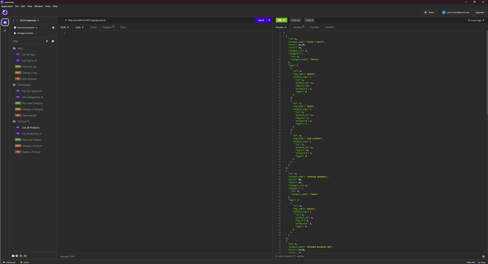
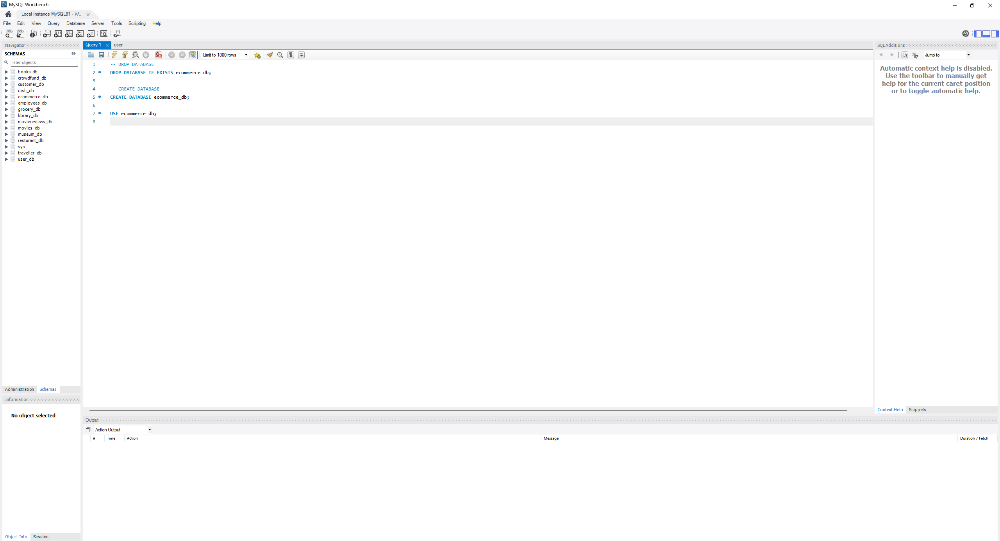

# E-Commerce

## Description

This e-commerce site helps us understand the relationship of Model View Control (MVC) and helps us deepen our understanding of the relationships between these three aspects. The model allows us to create database elements and store information within those elements. The control allows to call, update, and alter the data in the database and routes how that information is viewed on the front end. The View allows us to control what the end product for the user experience will be, allowing us to manipulate server side database data into something tangible for the users needs.

This project was built, in part, to help us make the connection between the theoretical relationships of MVC and the real-time reactions of how data is controlled, viewed, and manipulated. We can see in real time how data can be created, read, updated, or deleted in real time with the use of Insomnia. This helps us further our understanding of how MVC is used in daily operations to answer user requests from the servers perspective.

## Installation

You will need to first obtain a copy of the code. You do this by visiting the GitHub repository.

From here, you clone the appropriate code and clone it into the code editor of your choice.

You will also need a 3rd Party application known as Insomnia. After downloading and installing Insomnia, you will be able to view the changes to the codes database in real time.

You will also need to download and install SQL and the SQL Workbench in order to hold and reference your SQL database.

## Usage

The first thing you must do is open the Workbench after installing the workbench is open a new connection and then open a sql tab. Then you copy and execute the code found in the db/schema. You must also run the code line `USE ecommerce_bd;` This line of code will tell the workbench that you wish to use that specific data.

Then you must open your integrated terminal in your code editor and download/install all npm files with the code `npm i`. After all files are done downloading and installing, you must seed the opened database with the information you will be referencing. Do this by running the follow code command in your integrated terminal `node seeds/index.js`. This will seed your database with all the information you will be recalling and manipulating. Then run the code `node server.js` to spin up the server to allow you to use the data on Insomnia.

Open Insomnia and enter the localhost information in the top url searchbar. Referencing the routes found in the code, you are able to view and manipulate the data in the database. This includes GET, POST, PUT, and DELETE for the various categories of models.

## Credits
As always, this work was helped created with the insights of my fellow students at the UCLA bootcamp and the Instructors teaching the course. Their help has and continues to be invaluable when trying to understand and execute these concepts.

Google Drive Link: https://drive.google.com/file/d/1fNTh-JGd82gAVmCv3k0CZqXLQF8MxMXp/view